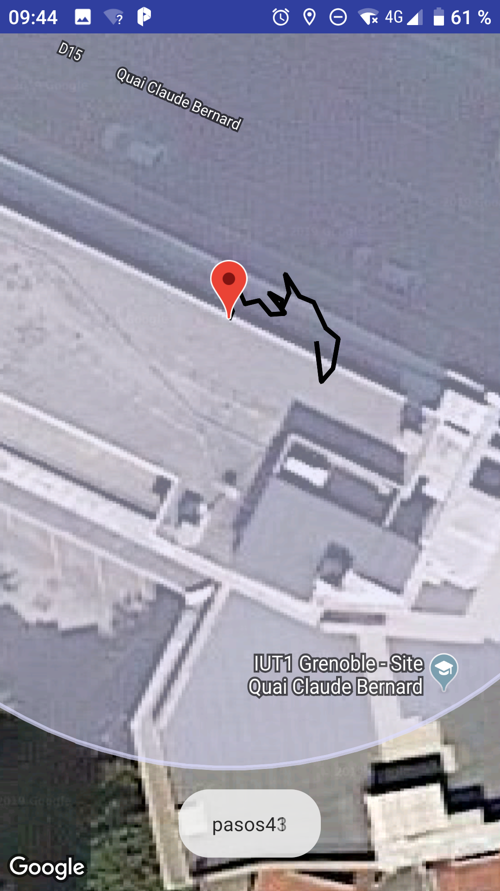
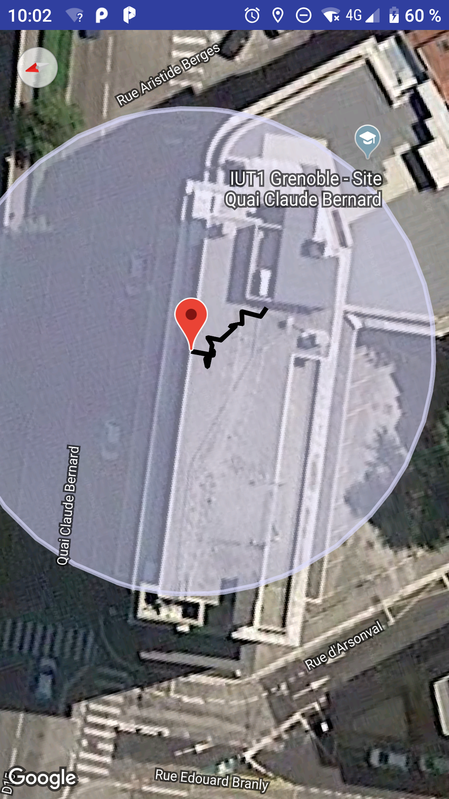
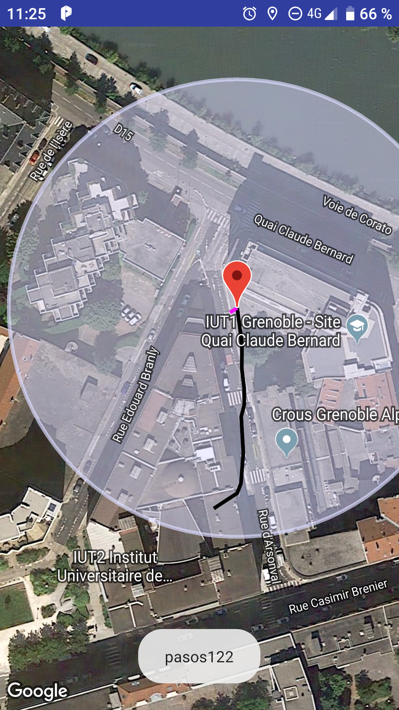

# Gps base
University project to learn the usage of the captors and sensors in an android device
# Description

The main task of this class was to develop an app that can show the movements of a user walking without the usage of the gps.

My approach to this problem was to use the gyroscope of the device and the step counter to estimate the trajectory of the user whit an error of 10m each kilometer walked.

With this project, I learned: 
- The types and usages of captors that modern phones usually have.
- Android permissions for captors.
- Drawing figures on maps (markers, figures, paths, circles)
- Captor noise filtering.

# Visuals

